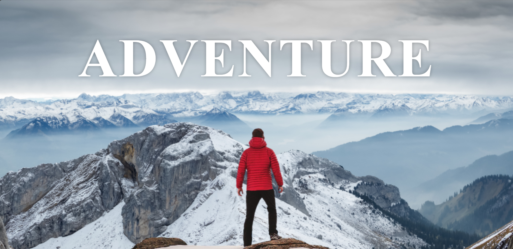
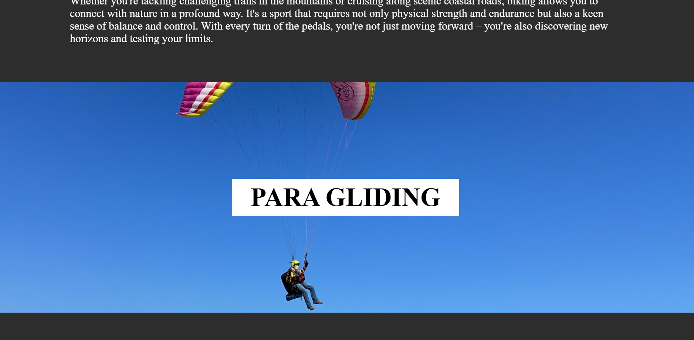

# 🏔️ Adventure Sports Blog — Parallax Website with Stunning Visuals

This is a clean and visually engaging website that showcases different adventure sports with stunning images and smooth scrolling effects.

🌐 **Live Site:** [https://adventure-sport-blog.netlify.app](https://adventure-sport-blog.netlify.app)

---

## ✨ Features

- **🎢 Parallax Scrolling:**  
  Seamless and dynamic browsing experience with visually appealing parallax effects.

- **📱 Responsive Design:**  
  Fully responsive layout for desktops, tablets, and smartphones.

- **📚 Engaging Content:**  
  Short writeups on biking, paragliding, and surfing.

- **🖼️ Visually Stunning:**  
  Clean, modern design with high-quality imagery to inspire adventure.

---

## 📸 Preview

---

## 🚀 Usage

Since the project is already deployed, you can directly visit the [live website](https://adventure-sport-blog.netlify.app) to explore it.
